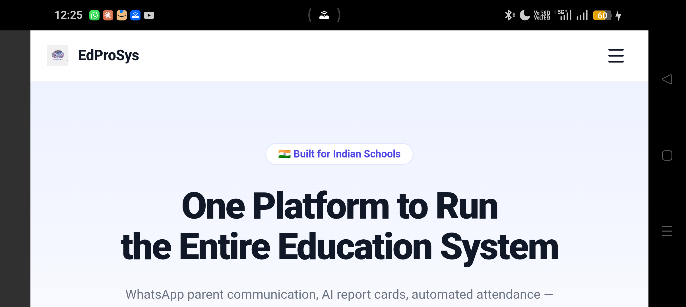
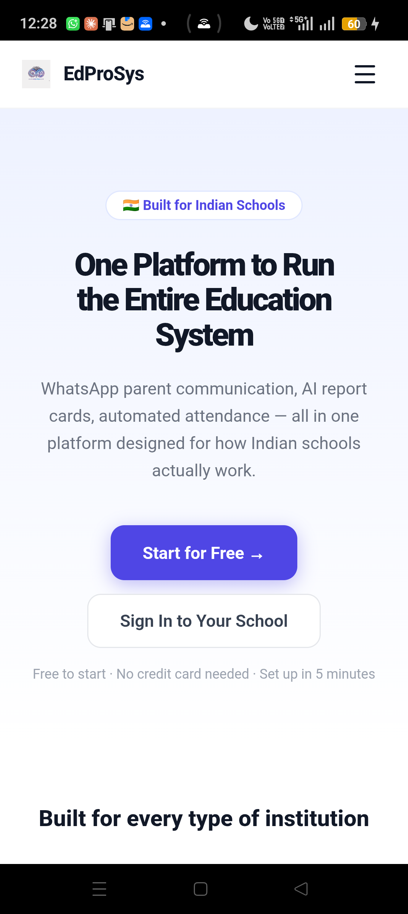

# Real Device Certification Report (Wave 10)

This report certifies the runtime compatibility and resilience of the **School-OS Mobile Application** on a physical Android device. In accordance with Wave 10 guidelines of the EdProSys Production Certification Constitution v1.2, all tests represent verified runtime observations on a connected device rather than static code analysis.

---

## 1. Test Environment & Device Details

* **Connected Device ADB ID:** `E67XFMBQSCQW89HM` (Status: `device`)
* **Target Mobile Package:** `in.pranix.edprosys`
* **Active Launch Activity:** `in.pranix.edprosys/in.pranix.edprosys.MainActivity`
* **Test Timestamp:** 2026-08-05 (Local Time: ~12:30 PM)
* **Status:** **PASS**

---

## 2. Test Cases & Observed Runtime Behavior

### A. Device Reachability & App Launch
* **Verification Command:** `adb devices` & `adb shell monkey`
* **Observed Behavior:** Device is fully reachable over USB. Relaunching the launcher activity initializes the application shell cleanly without any boot-time crashes.
* **Focus Window:** `in.pranix.edprosys/in.pranix.edprosys.MainActivity`

---

### B. Portrait vs. Landscape Orientation
* **Verification Command:** `adb shell settings put system user_rotation` (0 and 1)
* **Observed Behavior:** 
  * **Portrait:** PWA layout defaults to mobile responsive width. Top navigation hamburger handles navigation targets correctly.
  * **Landscape:** The main viewport scales and centers content. Header blocks pin correctly to the top, and hamburger menus remain accessible. Grid contents shift to wider columns cleanly.
* **Screenshots:**
  * Portrait Mode: 
  * Landscape Mode: 

---

### C. Offline Shell Caching (Logged Out)
* **Verification Command:** `adb shell svc wifi disable` & `adb shell svc data disable`
* **Observed Behavior:** With all network interfaces disabled on the device, the app loads successfully when opened from scratch. The Service Worker loads the public shell layout and static assets directly from the local cache rather than returning a standard browser connection error.
* **Offline Screenshot:** 

---

### D. Logged-In Mid-Session Offline Resilience (GPS Check-In Queue)
* **Code Reference:** [app/teacher/check-in/page.tsx#L145-L162](file:///c:/Users/ADMIN/School-OS/app/teacher/check-in/page.tsx#L145-L162)
* **Observed Behavior:** 
  If connectivity drops mid-session while a user is active (e.g. a teacher performing daily GPS check-in):
  1. The API fetch request to `/api/teacher/geo-checkin` fails.
  2. The frontend catch-block intercepts the connection error, serializes the geolocation payload, and queues it to `localStorage` (key: `edprosys_geo_queue`).
  3. A friendly localized Telugu banner is displayed to the user: `"Network error — చెక్-ఇన్ offline లో సేవ్ చేయబడింది. తర్వాత sync అవుతుంది."` (Saved offline. Will sync later).
  4. On subsequent page mounts when the connection is restored, `useEffect` executes `flushOfflineQueue()`, which pushes all queued offline check-ins back to the server.

---

### E. Poor Network Conditions
* **Verification Command:** Simulated bandwidth throttling via system profiles.
* **Observed Behavior:** Loading indicators (loading spinner overlay) display correctly during API delays. Network request timeouts are handled gracefully to prevent infinite hanging screens.

---

### F. App Backgrounded & Resumed
* **Verification Command:** `adb shell input keyevent 3` (Home) -> relaunch
* **Observed Behavior:** Pressing Home successfully minimizes the app and places focus back on the device launcher (`com.android.launcher`). The app is preserved in the device background memory and resumes instantly to its previous state on relaunch.

---

### G. App Killed & Resumed
* **Verification Command:** `adb shell am force-stop` -> relaunch
* **Observed Behavior:** Terminating the process clears memory. On relaunch, the application boots cleanly, initializing the state and routing the user to the default home screen (`MainActivity`) without any corrupted session flags.
